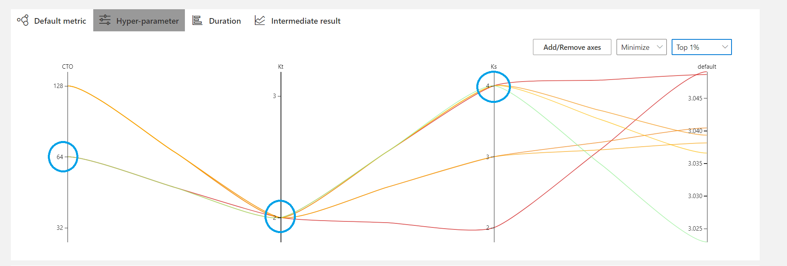

# A PyTorch Version of STGCN Base on [hazdzz/STGCN](https://github.com/hazdzz/STGCN)  with [nni](https://nni.readthedocs.io) for Hyperparameter Optimization

## Paper
*Spatio-Temporal Graph Convolutional Networks:
A Deep Learning Framework for Traffic Forecasting*.
https://arxiv.org/abs/1709.04875

## Model structure

## Hyperparameter Optimization
It seems here are 3 major parameters we can decide in the paper, temporal conv channels in the
Output block **CTO**, kernel size/radius in the temporal conv **Kt** as well as graph conv 
**Ks**.

So we conduct a hyperparameter optimization experiment that set the searching space as list follow:

CTO: [32, 64, 128]

Kt: [2, 3]

Ks: [2, 3, 4]

and run on metr-la dataset, 15 epoch per combination, 7:1:2 train:val:test radio.

After about 620 experiments, as shown in the following figure we select the top 1% result in 
the test data of all experiments, and it's clearly show that a **(CTO:64, Kt:2, Ks:4)** 
combination achieve better result.

